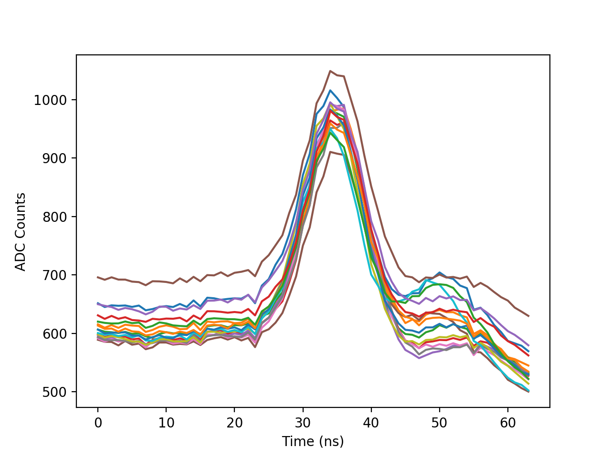

Analysis toolkit for the Prototype Schwarzschild-Couder Telescope ([pSCT](http://cta-psct.physics.ucla.edu/)). The SCT Toolkit is a collection of analysis tools with the following major components:

- [Pedestal](https://github.com/milesjwinter/SCT-toolkit/blob/master/sct_toolkit/pedestal.py): construct pedestal databases from calibration data
- [Quick Plots](https://github.com/milesjwinter/SCT-toolkit/blob/master/sct_toolkit/quick_plots.py): easily create plots to view raw and reconstructed data
- [Utils](https://github.com/milesjwinter/SCT-toolkit/blob/master/sct_toolkit/utils.py): utilities for viewing and buidling documentation
- [Waveform](https://github.com/milesjwinter/SCT-toolkit/blob/master/sct_toolkit/waveform.py): access raw and calibrated waveform data, apply pedestal subtraction
- [Analysis](https://github.com/milesjwinter/SCT-toolkit/blob/master/sct_toolkit/analysis.py): convenience tools for calculating standard metrics such as charge spectrums (work in progress)
- [Interactive](https://github.com/milesjwinter/SCT-toolkit/blob/master/sct_toolkit/interactive.py): create interactive plots that can be viewed in html (work in progress, see [here](https://github.com/milesjwinter/Interactive-Heatmap))

The toolkit is designed to take `.fits` files and convert them into a more analysis friendly format. The process begins with the construction of a pedestal and waveform databases. A run number and a list of modules are specified, then an hdf5 database, along with corresponding metadata, is generated as output. New databases can be created with a few short commands:

## Example Usage
### Pedestal Databases

```python
    from sct_toolkit import pedestal

    #specify the run to use 
    run_number = 322342

    #specify name for the new database 
    ped_name = 'my_run_files/pedestal_database_{}.h5'.format(run_number)

    #define list of module numbers (must be same order as when data was taken)
    modules = [118,125,126,119,108,121,110,128,123,124,112,100,111,114,107]

    #create new pedestal database
    ped = pedestal()
    ped.make_pedestal_database(ped_name=ped_name, 
                               run_number=run_number, 
                               modules=modules)
```
Once a pedestal database has been created, it can be used for calibrating data in a new waveform database.

### Waveform databases

```python
    from sct_toolkit import waveform

    #define list of module numbers (must be same order as when data was taken)
    modules = [118,125,126,119,108,121,110,128,123,124,112,100,111,114,107]
    
    #Add in some comments (optional but recommended)
    comments = 'backplane with cal trigger, LED at 100 Hz, trigger delay 685 ns, vped 1106'

    #Create a new waveform database
    wf = waveform()
    wf.write_events(run_number=322344, 
                    modules=modules,
                    ped_name='pedestal_database_322342.h5',
                    comments=comments,
                    outdir='my_run_files/')
```

By default, the output database will be named 'run322344.h5' and will be placed in the specified output directory. By specifiying a pedestal database, pedestal subtraction is performed automatically. Additionally, for each calibrated waveform, charge, amplitude, and position are calculated.

After the database has been created, we can pull it up and start our analysis. The first thing to note is that the metadata for the run is stored alongside the database and is automatically loaded when ``waveform`` is called.

```python
    >>> from sct_toolkit import waveform
    >>> wf = waveform('my_run_files/run322344.h5')
    >>> metadata = wf.get_attributes(verbose=True)
    asics: [0 1 2 3]
    channels: [ 0  1  2  3  4  5  6  7  8  9 10 11 12 13 14 15]
    channels_per_packet: 16
    charge_interval: -8, +8
    comments: 'backplane with cal trigger, LED at 100 Hz, trigger delay 685 ns, vped 1106'
    created_by: SCT_McGee
    date: 2017-11-08 16:37:01.822866
    keys: event, block, phase, timestamp, waveform, cal_waveform, amplitude, position, charge
    modules: [118 125 126 119 108 121 110 128 123 124 112 100 111 114 107]
    name: my_run_files/run322344.h5
    num_events: 59
    packet_size: 2100
    ped_name: my_run_files/pedestal_database_322342.h5
    run: 322344
    run_path: /Users/STC_McGee/target5and7data/run322344.fits
    structure: Module#/Asic#/Channel#/'keys'
    waveform_length: 64
```

The database has a branch-like structure with dictionary keys for each stored quantity. For example, the raw waveform array for module 123, ASIC 0, channel 0 can be accessed using ``wf.get_branch('Module123/Asic0/Channel0/waveform')``. Additionally, because metadata is automatically loaded, quantities such as number of events, readout window, module list, etc. never have to be explicitely defined by the user. For example, we can easily pull up raw waveforms for all modules, ASICs, and channels and store them in an array for further analysis:

```python
    from sct_toolkit import waveform
    import numpy as np

    #load database
    wf = waveform('my_run_files/run322344.h5')

    #create array to hold waveforms
    data = np.zeros((len(wf.get_module_list()),
                     len(wf.get_asic_list()),
                     len(wf.get_channel_list()),
                     wf.get_n_events(),
                     wf.get_n_samples()), dtype=int)

    #get waveform data for each branch
    for m, mod in enumerate(wf.get_module_list()):
        for a, asic in enumerate(wf.get_asic_list()):
            for c, channel in enumerate(wf.get_channel_list()):
                branch_name = 'Module{}/Asic{}/Channel{}/waveform'.format(mod,asic,channel)
                data[m,a,c] = np.array(wf.get_branch(branch_name))

```

The structure also makes plotting very easy. If we wanted to overlay all average waveforms of all channels in Module 108, Asic 2, for example, we would simply do:

```python
    from sct_toolkit import waveform
    import matplotlib.pyplot as plt
    import numpy as np

    wf = waveform('my_run_files/run322344.h5')

    plt.figure()
    for channel in wf.get_channel_list():
        data = np.array(wf.get_branch('Module108/Asic2/Channel{}/waveform'.format(channel)))
        plt.plot(np.mean(data,axis=0))
    plt.xlabel('Time (ns)')
    plt.ylabel('ADC Counts')
    plt.show()
```


